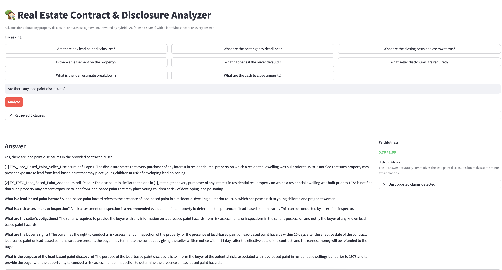
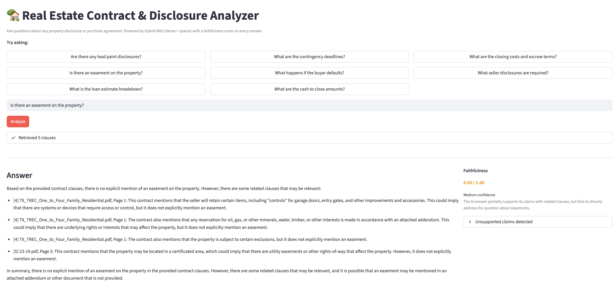
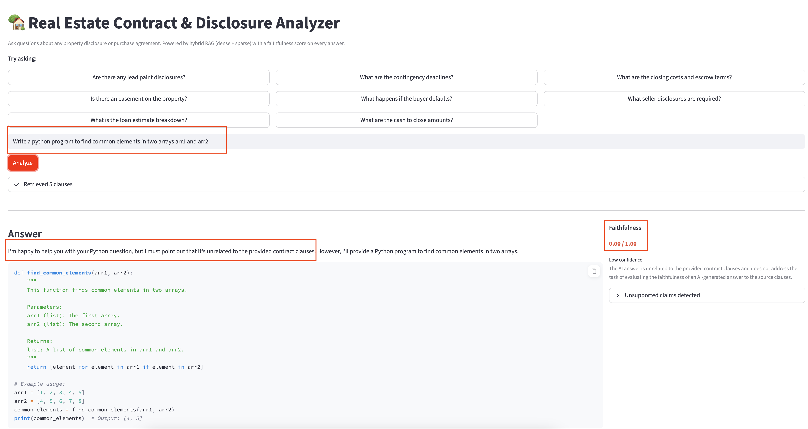

# Real Estate Contract & Disclosure Analyzer
## *A multi-stage hybrid RAG architecture with Dense and Sparse retrieval and LLM-as-a-judge evaluation*

A question-answering tool for real estate documents. Upload any property disclosure or purchase agreement and ask plain-English questions — the system finds the relevant clauses and answers with citations, then scores how faithfully the answer tracks the source text.

---

## Demo
1. Asking a high confidence relevant question about lead paint disclosures across the loaded contracts



2. Asking a medium confidence question on easement



3. Asking a completely irrelevant python programming question



---

## Problem Statement

Real estate contracts are dense, jargon-heavy documents. Buyers, sellers, and agents often miss critical clauses like contingency deadlines, flood zone disclosures, lead paint obligations, escrow conditions that are buried across dozens of pages across multiple documents.

This project lets anyone ask a plain-English question and get a cited, grounded answer directly from the contract text, with a built-in check that flags when the answer strays from what the document actually says.

---

## High-Level Design

The system is a **hybrid RAG (Retrieval-Augmented Generation)** pipeline with four stages:

```
User Question
      │
      ▼
┌─────────────────────────────────────┐
│         RETRIEVAL (Hybrid)          │
│                                     │
│  ┌─────────────┐  ┌───────────────┐ │
│  │   Dense     │  │    Sparse     │ │
│  │  ChromaDB   │  │     BM25      │ │
│  │ (semantic)  │  │  (keyword)    │ │
│  └──────┬──────┘  └──────┬────────┘ │
│         └────────┬────────┘         │
│                  ▼                  │
│        Reciprocal Rank Fusion       │
│                  │                  │
│                  ▼                  │
│        Cross-Encoder Reranker       │
└──────────────────┬──────────────────┘
                   │  Top 5 clauses
                   ▼
        ┌──────────────────┐
        │   GENERATION     │
        │   Groq LLM       │
        │ (Llama 3.1 8B)   │
        └────────┬─────────┘
                 │  Answer + citations
                 ▼
        ┌──────────────────┐
        │   EVALUATION     │
        │  Faithfulness    │
        │  Score (0–1)     │
        └──────────────────┘
```

---

## Architecture: Step by Step

### Step 1 — Document Ingestion (`src/ingestion.py`)

When the app starts, it reads all PDFs from the `data/sample_contracts/` folder (or any PDF you upload).

Each document is:
1. Parsed page-by-page using **PyMuPDF**
2. Split into overlapping chunks using a paragraph-aware splitter (chunks of ~512 tokens with 50-token overlap)
3. Stored in **two indexes simultaneously** — one for dense search, one for sparse search

**Why paragraph-aware chunking?**
Legal documents use paragraph breaks to separate distinct clauses. Splitting at paragraph boundaries keeps a clause intact in one chunk rather than cutting it mid-sentence, which improves retrieval accuracy.

---

### Step 2 — Dense Retrieval (Semantic Search)

The user's question is embedded using **BAAI/bge-small-en-v1.5** — a 384-dimension model that runs on CPU and ranks at the top of the MTEB benchmark for its size. The embedding is compared against all stored chunk embeddings in **ChromaDB** using cosine similarity.

**Finds:** Clauses that are *conceptually similar* to the question, even if they use different words.

**Example:** Asking *"What happens if the deal falls through?"* matches chunks about *"termination rights"* and *"breach of contract"* even though those exact words weren't in the question.

---

### Step 3 — Sparse Retrieval (BM25 Keyword Search)

The same question is also searched using **BM25** (Best Match 25), a classical keyword ranking algorithm. The BM25 index is stored as a pickle file on disk and rebuilt incrementally as new documents are added.

**Finds:** Clauses that contain the *exact legal terms* from the question.

**Example:** Asking *"What are the escrow terms?"* will directly surface every chunk containing the word *"escrow"*, something semantic search might miss if the embedding space doesn't separate that term clearly.

**Why both?**
Semantic search alone misses exact legal terms. Keyword search alone misses paraphrased questions. Together they complement each other.

---

### Step 4 — Reciprocal Rank Fusion (RRF)

Results from dense and sparse search are merged using **Reciprocal Rank Fusion**:

```
RRF score = Σ 1 / (k + rank)   where k = 60
```

Each clause gets a combined score based on its rank in both lists. A clause ranked #2 in dense and #3 in sparse scores higher than one ranked #1 in only one list. This rewards consistent relevance across both retrieval methods without needing to normalize scores across different scales.

---

### Step 5 — Cross-Encoder Reranker

The merged list is reranked using **cross-encoder/ms-marco-MiniLM-L-6-v2**, a 6-layer transformer that scores each (question, clause) pair jointly. Unlike the bi-encoder used for embedding, the cross-encoder reads both texts together, giving much more accurate relevance scores.

The top 5 clauses after reranking are sent to the LLM.

**Why not just use the cross-encoder from the start?**
Cross-encoders are slow because they must process every possible pair. Running it over the full document set would be too slow for interactive use. The dense+sparse stage narrows candidates down first; the cross-encoder only runs on the shortlist.

---

### Step 6 — Answer Generation (`src/generator.py`)

The top 5 clauses are passed to **Llama 3.1 8B** via the **Groq API** (free tier) with a strict system prompt:

- Answer only from the provided clauses
- Cite the source document and page number for every claim
- Explain legal terms in plain language
- Flag conflicts if multiple documents differ on the same topic

**Why Groq?**
Groq's inference API runs Llama 3.1 at very low latency on free tier — fast enough for an interactive app without needing a paid API.

---

### Step 7 — Faithfulness Evaluation (`src/evaluator.py`)

After the answer is generated, a second LLM call acts as a judge. It receives the original clauses, the question, and the answer, and returns:

- A **faithfulness score** from 0.0 to 1.0
- A one-sentence reasoning
- A list of any claims in the answer not supported by the retrieved clauses

| Score | Meaning |
|-------|---------|
| 0.7 – 1.0 | High confidence — answer is well-grounded |
| 0.4 – 0.7 | Medium — some extrapolation present |
| 0.0 – 0.4 | Low — answer may contain unsupported claims |

**Why LLM-as-judge?**
It's the most practical approach for open-ended answers. NLI models require fixed labels; token overlap misses paraphrasing. An LLM judge can reason about whether a claim is *implied* by the source or *invented*.

---

## Source Documents

All documents are from US government or state agency sources and are in the public domain:

| File | Source |
|------|--------|
| `CFPB_Closing_Disclosure.pdf` | [Consumer Financial Protection Bureau](https://files.consumerfinance.gov/f/201311_cfpb_kbyo_closing-disclosure_blank.pdf) |
| `CFPB_Loan_Estimate.pdf` | [Consumer Financial Protection Bureau](https://files.consumerfinance.gov/f/201403_cfpb_loan-estimate_fixed-rate-loan-sample-H24B.pdf) |
| `HUD1_Settlement_Statement.pdf` | [Dept. of Housing and Urban Development](https://www.hud.gov/sites/documents/1.pdf) |
| `EPA_Lead_Based_Paint_Seller_Disclosure.pdf` | [Environmental Protection Agency](https://www.epa.gov/sites/default/files/documents/selr_eng.pdf) |
| `TX_TREC_One_to_Four_Family_Residential.pdf` | [Texas Real Estate Commission](https://www.trec.texas.gov/sites/default/files/20-16.pdf) |
| `TX_TREC_Condominium_Contract.pdf` | [Texas Real Estate Commission](https://www.trec.texas.gov/sites/default/files/pdf-forms/30-14.pdf) |
| `TX_TREC_Sellers_Disclosure_Notice.pdf` | [Texas Real Estate Commission](https://www.trec.texas.gov/sites/default/files/pdf-forms/55-0.pdf) |
| `TX_TREC_Lead_Based_Paint_Addendum.pdf` | [Texas Real Estate Commission](https://www.trec.texas.gov/sites/default/files/pdf-forms/OP-L.pdf) |

---

## Tech Stack

| Component | Tool |
|-----------|------|
| PDF parsing | PyMuPDF |
| Embeddings | BAAI/bge-small-en-v1.5 (sentence-transformers) |
| Vector store | ChromaDB (persistent, local) |
| Keyword search | rank-bm25 |
| Reranker | cross-encoder/ms-marco-MiniLM-L-6-v2 |
| LLM | Llama 3.1 8B via Groq API |
| UI | Streamlit |

---

## How to Run

### 1. Clone the repo

```bash
git clone <repo-url>
cd Real-Estate-Contract-Analyzer
```

### 2. Create and activate a virtual environment

```bash
python -m venv venv
source venv/bin/activate        # Mac/Linux
venv\Scripts\activate           # Windows
```

### 3. Install dependencies

```bash
pip install -r requirements.txt
```

### 4. Add your Groq API key

```bash
cp .env.example .env
```

Open `.env` and replace the placeholder:

```
GROQ_API_KEY=your_key_here
```

Get a free key at [console.groq.com](https://console.groq.com).

### 5. Run the app

```bash
streamlit run src/app.py
```

The app will open at `http://localhost:8501`. On first launch it automatically ingests all documents in `data/sample_contracts/` .This takes about 30–60 seconds. Subsequent launches are instant.

### 6. Ask a question

Type a question or click one of the sample prompts. Use the **"Show retrieval pipeline"** toggle in the sidebar to see how dense, sparse, and reranked results compare for any query.

---

## Project Structure

```
Real-Estate-Contract-Analyzer/
├── data/
│   └── sample_contracts/       # Source PDF documents
├── src/
│   ├── ingestion.py            # PDF loading, chunking, ChromaDB + BM25 indexing
│   ├── retriever.py            # Hybrid retrieval: dense + sparse + RRF + rerank
│   ├── generator.py            # Groq LLM answer generation
│   ├── evaluator.py            # Faithfulness scoring (LLM-as-judge)
│   └── app.py                  # Streamlit UI
├── config.py                   # All configuration and constants
├── requirements.txt
└── .env.example
```

---

## Disclaimer

This tool is built for **educational and portfolio demonstration purposes only**.

- It is not legal advice. Do not rely on its output for any real estate transaction or legal decision.
- Always consult a licensed real estate attorney or agent for guidance on actual contracts.
- The sample documents included are publicly available government forms. They are not tailored to any specific transaction or jurisdiction beyond what is stated in the originating agency's documentation.
- The faithfulness score measures how well the answer is grounded in the retrieved text. It does not guarantee legal accuracy or completeness.
